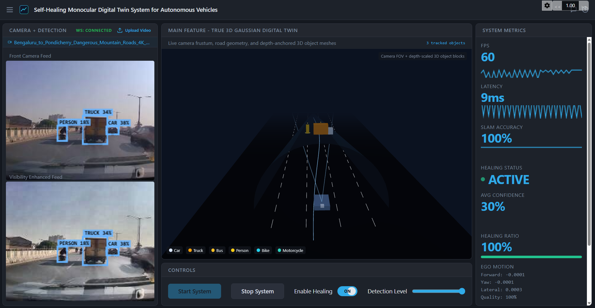

# Self-Healing Monocular Digital Twin for Autonomous Vehicles

## Project Overview
This project builds a real-time monocular digital twin pipeline for autonomous driving scenarios. It processes a single dashcam stream, simulates real-world visual degradation, restores affected regions, detects key road objects, and maps detections into an approximate 3D scene for live visualization.

## Frontend Preview


## Objective
The system is designed to:
- Process a single dashcam video (monocular input)
- Detect and classify objects such as car, person, bike, and truck
- Simulate realistic degradation effects including fog, blur, and partial occlusion
- Restore degraded image regions using a self-healing pipeline
- Convert 2D detections into approximate 3D positions
- Reconstruct a live scene representation using Gaussian splatting
- Display the full pipeline output in an interactive dashboard

## End-to-End Workflow
Video Input -> Occlusion Simulation -> Healing -> Object Detection -> 2D to 3D Mapping -> Gaussian Reconstruction -> Live Dashboard

## Core Modules

### 1. Input Module
- Accepts dashcam video input
- Processes frames sequentially in real time
- Uses monocular vision instead of multi-sensor fusion

### 2. Occlusion Simulation Module
- Introduces realistic degradations:
	- Fog
	- Blur
	- Partial obstruction
- Stress-tests robustness under challenging road conditions

### 3. Healing Module
- Restores degraded regions using:
	- CLAHE (Contrast Limited Adaptive Histogram Equalization)
	- Sharpening filters
- Applies restoration selectively to occluded regions rather than the full frame

### 4. Object Detection Module
- Runs detection on healed frames
- Detects key traffic participants:
	- Car
	- Person
	- Bike
	- Truck
- Improves detection reliability in degraded scenes

### 5. 2D to 3D Mapping Module
- Converts 2D bounding boxes into approximate 3D positions
- Uses object scale for depth cues and screen position for spatial mapping
- Provides practical monocular depth approximation for digital twin reconstruction

## Tech Stack
- Frontend: React + Vite + TypeScript
- Backend: FastAPI + WebSocket
- Vision: OpenCV + YOLO
- 3D Scene: Gaussian-splatting-based reconstruction and visualization

## Run Locally

### Prerequisites
- Node.js 18+
- Python 3.10+

### 1. Install frontend dependencies
```bash
npm install
```

### 2. Create and activate Python virtual environment
Windows PowerShell:
```powershell
python -m venv .venv
.\.venv\Scripts\Activate.ps1
pip install -r backend/requirements.txt
```

### 3. Start the project

Quick start (recommended on Windows):
```powershell
.\run-dev.ps1
```

Manual start (two terminals):

Terminal 1 (backend):
```powershell
npm run dev:backend
```

Terminal 2 (frontend):
```powershell
npm run dev
```

### 4. Open in browser
- Frontend: `http://localhost:8080`
- Backend health: `http://localhost:8000/health`